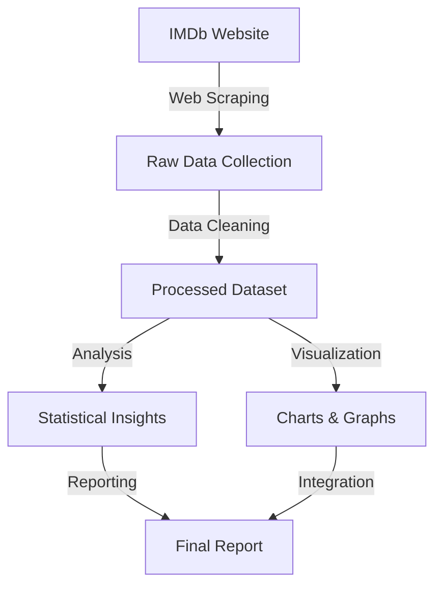

# Movie Scraping Data Analysis Project

   

## 📋 Project Overview

A data analysis project that scrapes IMDb's Top 250 movies list, processes the data, and generates visualizations for insights.


## 🎯 Project Architecture

```
📦 movie-review-analysis
 ┣ 📂 src
 ┃ ┣ 📜 main.py
 ┃ ┣ 📂 scraper
 ┃ ┣ 📂 analysis
 ┃ ┗ 📂 visualization
 ┣ 📂 data
 ┃ ┗ 📜 imdb_top_250_movies.csv
 ┣ 📂 output
 ┃ ┣ 📂 charts
 ┃ ┗ 📂 reports
 ┣ 📜 requirements.txt
 ┗ 📜 README.md
```

## 🛠️ Prerequisites

- Python 3.10 or higher
- Required Python packages (listed in requirements.txt)

## 🚀 Setup and Installation

1. Clone the repository
```bash
git clone <your-repo-url>
cd Movie-Scrapping-DA-Project
```

2. Install dependencies
```bash
pip install -r requirements.txt
```

## 📊 Usage

### Scrape IMDb Top 250 movies
```bash
python src/main.py --scrape
```

### Analyze the scraped data
```bash
python src/main.py --analyze
```

### Generate visualizations
```bash
python src/main.py --visualize
```

### Get help
```bash
python src/main.py --help
```

## 🔄 Data Flow



## 📊 Analysis Framework

### Statistical Analysis
- Mean, median, mode of ratings
- Standard deviation
- Quartile distribution
- Outlier detection

### Temporal Analysis
- Year grouping
- Decade analysis
- Trend identification
- Pattern recognition

### Genre Analysis
- Distribution of genres
- Genre correlation with ratings
- Popular genre combinations

## 📈 Expected Visualizations

1. Rating Distribution
2. Movies by Decade
3. Genre Distribution
4. Temporal Trends

## 🛠️ Technical Stack

| Category | Technologies |
|----------|-------------|
| Core Language | Python 3.x |
| Web Scraping | BeautifulSoup4, Requests |
| Data Processing | Pandas, NumPy |
| Visualization | Matplotlib, Seaborn |
| Data Storage | CSV |

## 🔍 Implementation Steps

1. **Data Collection**
```python
# Sample scraping code
url = 'http://www.imdb.com/chart/top'
response = requests.get(url)
soup = BeautifulSoup(response.text, "html.parser")
```

2. **Data Processing**
```python
# Sample processing code
df = pd.DataFrame(movie_list)
df['year'] = df['year'].astype(int)
df['rating'] = df['rating'].astype(float)
```

3. **Analysis**
```python
# Sample analysis code
summary_stats = df['rating'].describe()
decade_analysis = df.groupby(df['year']//10*10).agg({
    'rating': ['mean', 'count']
})
```

## 📚 References

- [IMDb Website](https://www.imdb.com)
- [BeautifulSoup Documentation](https://www.crummy.com/software/BeautifulSoup/bs4/doc/)
- [Pandas Documentation](https://pandas.pydata.org/docs/)

## 👤 Author

Chirag Kumar

## 🤝 Contributors

- Nishant Singh


## 📄 License

This project is licensed under the MIT License - see the LICENSE file for details.

