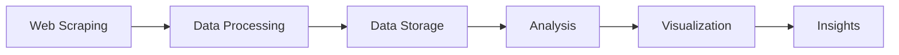
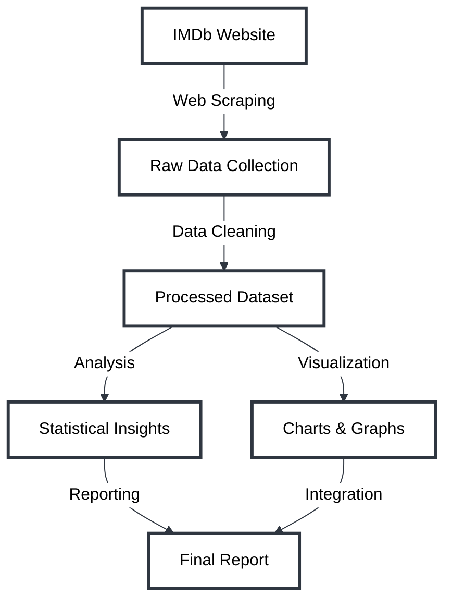
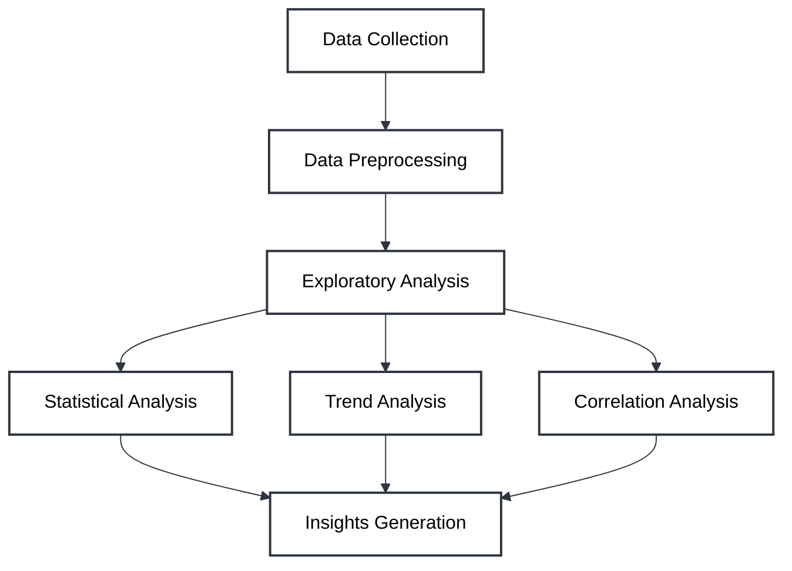
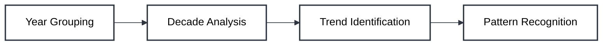
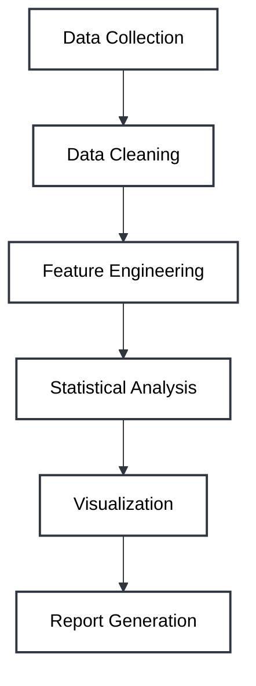

# Movie Review Scraping and Analysis

   

## 📋 Project Overview



This data analytics project focuses on scraping movie review data from IMDb's top 250 movies, followed by comprehensive analysis to derive insights about movie ratings, trends over time, and correlations between different movie attributes. 

## 🎯 Project Architecture

```
📦 movie-review-analysis
 ┣ 📂 src
 ┃ ┣ 📜 scraping.py
 ┃ ┣ 📜 analysis.py
 ┃ ┗ 📜 visualization.py
 ┣ 📂 data
 ┃ ┗ 📜 imdb_top_250_movies.csv
 ┣ 📂 output
 ┃ ┣ 📂 charts
 ┃ ┗ 📂 reports
 ┣ 📜 requirements.txt
 ┗ 📜 README.md
```

## 🔄 Data Flow



## 📊 Analysis Framework



## 🛠️ Technical Stack

| Category | Technologies |
|----------|-------------|
| Core Language | Python 3.x |
| Web Scraping | BeautifulSoup4, Requests |
| Data Processing | Pandas, NumPy |
| Visualization | Matplotlib, Seaborn |
| Data Storage | CSV |

## 📈 Expected Visualizations

1. Rating Distribution
```
     Rating Distribution
     |    ▄▄▄
8.0+ |  ▄█████▄
7.5+ |▄███████████▄
7.0+ |██████████████
     +---------------
     7.0  7.5  8.0  8.5  9.0
```

2. Movies by Decade
```
Count |    ▄▄
40+   |    ██
30+   |  ▄▄██▄▄
20+   |  ██████
10+   |▄███████▄
      +----------
      1950s 70s 90s 2010s
```

## 🔍 Data Analysis Components

### 1. Statistical Analysis
- Mean, median, mode of ratings
- Standard deviation
- Quartile distribution
- Outlier detection

### 2. Temporal Analysis


### 3. Genre Analysis
- Distribution of genres
- Genre correlation with ratings
- Popular genre combinations

## 📊 Key Metrics

| Metric | Analysis Method |
|--------|----------------|
| Rating Trends | Time series analysis |
| Genre Impact | Correlation analysis |
| Year Effect | Regression analysis |
| Cast Influence | Network analysis |

## 🎯 Implementation Steps

1. **Data Collection Phase**
   ```python
   # Sample scraping code
   url = 'http://www.imdb.com/chart/top'
   response = requests.get(url)
   soup = BeautifulSoup(response.text, "html.parser")
   ```

2. **Data Processing Phase**
   ```python
   # Sample processing code
   df = pd.DataFrame(movie_list)
   df['year'] = df['year'].astype(int)
   df['rating'] = df['rating'].astype(float)
   ```

3. **Analysis Phase**
   ```python
   # Sample analysis code
   summary_stats = df['rating'].describe()
   decade_analysis = df.groupby(df['year']//10*10).agg({
       'rating': ['mean', 'count']
   })
   ```

## 📈 Expected Outcomes

1. **Rating Distribution**
   - Histogram of movie ratings
   - Box plots for rating spread

2. **Temporal Patterns**
   - Line graphs of ratings over time
   - Decade-wise analysis

3. **Correlation Analysis**
   - Heat maps of variable relationships
   - Scatter plots of key metrics

## 🔄 Project Workflow



## 📝 Documentation Structure

```
📑 Project Documentation
├── 📋 Overview
├── 🎯 Objectives
├── 📊 Methodology
├── 📈 Results
└── 📝 Conclusions
```

## 🚀 Future Enhancements

1. **Advanced Analytics**
   - Sentiment analysis of reviews
   - Machine learning predictions
   - Natural language processing

2. **Additional Features**
   - Interactive dashboards
   - Real-time data updates
   - API integration

## 📚 References

- [IMDb Website](https://www.imdb.com)
- [BeautifulSoup Documentation](https://www.crummy.com/software/BeautifulSoup/bs4/doc/)
- [Pandas Documentation](https://pandas.pydata.org/docs/)
- [GeeksforGeeks Tutorial](https://www.geeksforgeeks.org/scrape-imdb-movie-rating-and-details-using-python/)

## 👤 Author

Chirag Kumar

## 📄 License

This project is licensed under the MIT License - see the LICENSE file for details.